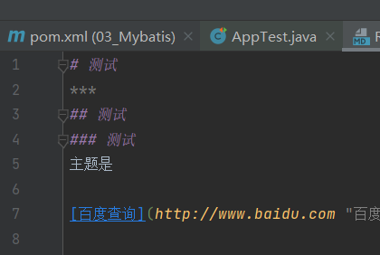
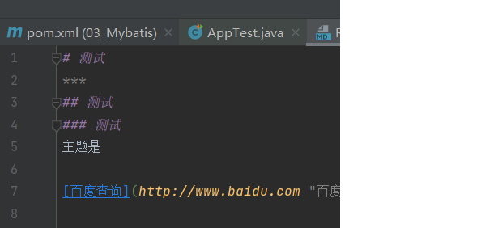
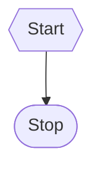
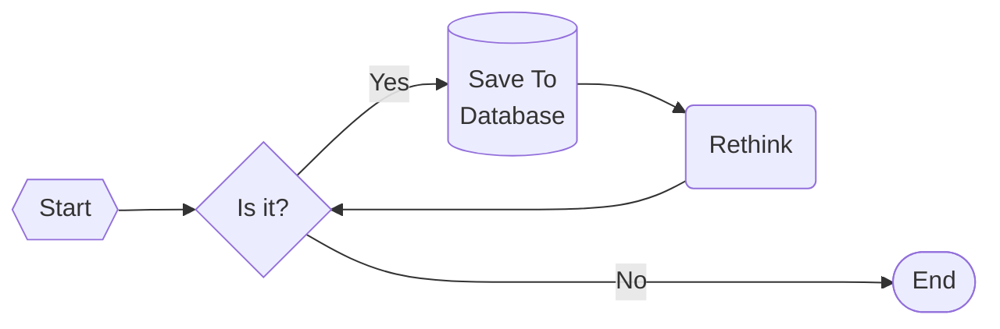

啊

| 左对齐                                             |   右对齐 |  居中对齐   |
|:------------------------------------------------|------:|:-------:|
| <font color=#ff0000 size=3 face="楷体">单元格</font> | *单元格* |   单元格   |
| **单元格**                                         |   单元格 | ~~单元格~~ |


```
使用 *文字* 表示斜体；  
使用 **文字** 表示粗&emsp;体；  
使用 ***文字*** 表示粗斜体；  
使用 ~~文字~~ 表示删除线；  
段落尾连续使用两个回车表示换行；  
行尾使用两个空格+一个回车表示段内换行
使用"&emsp;"表示空格。 
```
#
#
```java
public class User {
    private Integer id;
    private String Name;
    private Integer age;
    private Date birthday;
}
```
###
    public class User {
        private Integer id;
        private String Name;
        private Integer age;
        private Date birthday;
    }


# 
# 
#


>使用 *文字* 表示斜体；  
>>使用 **文字** 表示粗&emsp;体；  
>>使用 ***文字*** 表示粗斜体；  
>>使用 ~~文字~~ 表示删除线；  
>>>段落尾连续使用两个回车表示换行；  
>>>行尾使用两个空格+一个回车表示段内换行
>>>>使用"&emsp;"表示空格。
>>
>> 这样可以跳转到第二层！  
> 
>这样可以跳转到第一层！


## 测试
***
测试
-- -


## 测试


主题是

[百度查询](http://www.baidu.com "百度")


代码**测试**是一件让  
>人兴奋的事情

我们

    <dependency>
      <groupId>org.junit.jupiter</groupId>
      <artifactId>junit-jupiter-engine</artifactId>
      <version>5.8.2</version>
      <scope>test</scope>
    </dependency>

一个&#160;&#160;&#160;&#160;用户 ABC

一个&ensp;&ensp;&ensp;&ensp;用户

    public User(Integer id, String name, Integer age, Date birthday) {
        this.id = id;
        Name = name;
        this.age = age;
        this.birthday = birthday;
    }


sequenceDiagram
文本审核基础服务->>odps:读取训练数据（文本分词）
activate odps
odps-->>文本审核基础服务:返回训练数据（文本分词）
deactivate odps
文本审核基础服务->>文本审核基础服务:模型训练
文本审核基础服务->>文本审核基础服务:预测测试集
文本审核基础服务->>文本审核基础服务:计算模型指标
文本审核基础服务->>odps:写入模型
文本审核基础服务->>odps:写入模型指标数据

```sequenceDiagram
	运营人员->>+cms:访问cms监督模块
	cms->>+rds:获取预测结果列表（分类的数量均匀）
	rds-->>-cms:返回预测结果
	cms-->>-运营人员:返回预测结果列表
	运营人员->>+cms:重新标注错误的预测
	cms->>-rds:存储标注结果
	odps->>rds:周期性抽取新的标注结果
	odps->>odps:补充样本数据

```
`<div>User Infomation</div>`

`Name:<input size="30"></input>`


`



